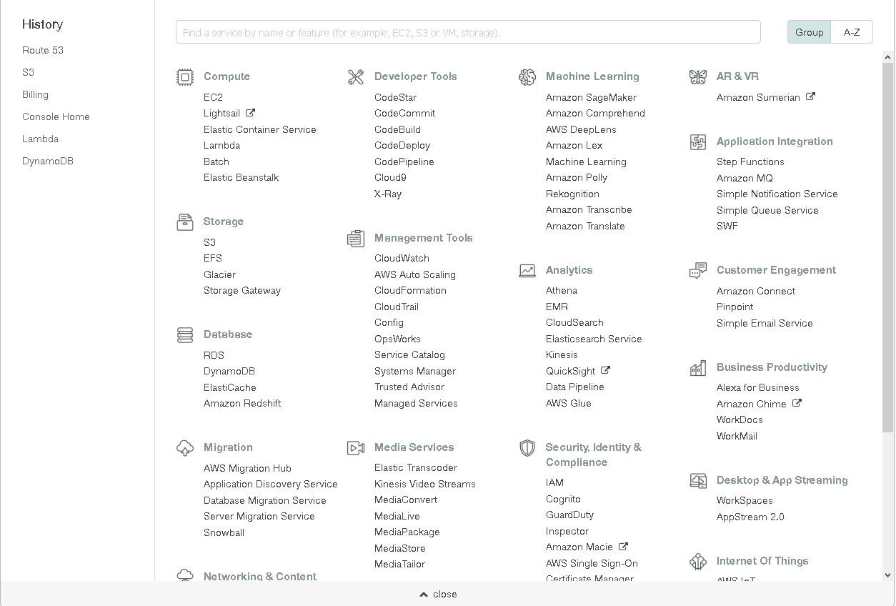

# Знакомство с AWS

## Введение

**Amazon Web Services** (AWS) — изначально IT-инфраструктура компании Amazon,
получившаяся настолько удачной, что постепенно она переросла в поставщика
облачных веб-сервисов. И сейчас, в 2018 году, данная платформа является одним
из лидеров предоставления облачных услуг, наравне с
[Microsoft Azure](https://azure.microsoft.com) или
[Google Compute Engine](https://cloud.google.com/compute/).

Целью данной книги является познакомить читателя с данной платформой,
создав небольшой учебный проект — простенький менеджер семейного бюджета.
Изначальный замысел данного проекта был повторение результатов, описанных в
статье [Хабрахабра](https://habrahabr.ru/post/334146/) для проверки
его реализуемости.

Сама платформа AWS состоит из большого множества веб-сервисов, каждый
из которых выполняет свою функцию: будь то управление электронной почтой,
настройкой DNS, управление реляционной или нереляционной базой данный и т.п.
Основной отличительной чертой, делающей эти сервисы настолько популярными,
является то, что используя веб-интерфейс, мы легко можем настроить взаимодействие
между сервисами, тем самым создав систему с необходимой нам функциональностью.

<b>Панель управления AWS — список сервисов</b>

Поэтому описание в книге разделено на две основные части:

* В первой части описываются необходимые для работы сервисы и действия,
которые можно совершить с их помощью;
* Во второй же части, обсуждается создание проекта: от
архитектуры взаимодействия описанных ранее сервисов до написания логики
самого приложения.

Книга пишется с расчетом на то, что детальное описание выполнения данного проекта
может послужить основой к проведению лабораторных работ в университете, а так
же созданию новых проектов и изучаемых сервисов Amazon. Поэтому
приветствуется создание пулл-реквестов на обновление данной книги
([github-репозиторий](https://github.com/Suhoy95/aws-bootstrap-pdf)).

## Предварительные требования

При выполнении данного проекта подразумевается, что учащийся уже
имеет *доступ к AWS*, а так же имеет *возможность редактировать DNS-записи*
какого-либо веб-домена. К сожалению, данные требования могут стать самой
большим препядствием (а также не факт, что это будет бесплатно),
поэтому я постараюсь дать несколько советов, как можно подготовится.

Для регистрации в AWS:
1. Попробуйте [GitHub Education](https://tproger.ru/articles/free-from-github/) и
расскажите о полученном опыте;
2. Для регистрации потребуется банковская карта. При регитрации с вас снимут 1 доллар
для проверки валидности карты. Желательно использовать карту с ограниченной суммой,
чтобы не потерять деньги в случае ошибки;
3. Следите, какими сервисами вы пользуюетесь и входят ли они в подписку. Если
необходимости в каком-то сервисе нет — удалите. Если вы ничем не пользуюетесь, то
ни за что и не платите;
4. Также потребуется привязка сотового телефона. Будьте готовы слушать цифры,
надиктованные роботом =);
5. При регистрации моего аккаунта возникла ошибка, из-за чего доступ к сервисам был
приостановлен. В ходе диалога с поддержкой Амазон мне понадобилось отправить
чек банка, подтверждающий тестовую оплату в 1$;
6. После регистрации одного аккаунта, можно создавать аккаунты в сервисе [IAM](services/iam.md)
и вести разработку коллективно. Главное следите, что не превышаете месячный лимиты на использование того или иного сервиса.

Для работы с DNS есть множество путей:
1. Можно приобрести домен. Конечно, это можно сделать на сайте Amazon, но в
образовательных целях платить 10-12$ за домен *.com не очень целесообразно.
Мною, до выполнения этой работы, домен был уже куплен у хостинг-провайдера
[firstbyte.ru](https://firstbyte.ru/) и обошелся в 100-200 рублей за год.
2. Спросите преподавателей и администраторов университета. Скорее всего они
будут не против предоставить какой-нибудь домен 3-го уровня в учебных целях.
3. Опять же попробуйте [GitHub Education](https://tproger.ru/articles/free-from-github/)
и расскажите, как все получилось.

## Дополнительные советы при выполнении проекта

Не смотря на то, что в книге все шаги будут описаны как можно подробнее, не
факт, что не удастся покрыть какой-то особый случай при работе с AWS.
Поэтому не бойтесь знакомится с
[официальной документацией Амазон](https://aws.amazon.com/ru/documentation/),
которая постепенно переводится на русский язык. Будет даже лучше, если эта
документация станет первичным источником информации по сервисам Амазон,
а книга будет лишь путеводителем по упражнениям, на которых вы можете
посмотреть возможности данной платформы.

Данная книга описывает описывает только работу с сервисами Амазона. Однако,
стоит понимать, что все эти сервисы — это всего лишь красивые и удобные обертки
с бантиками реализующие общие идеи, появившиеся в разработке программного
обеспечения и веб-сервисов. Поэтому очень полезно понимать, что именно
делает за вас Амазон, а также знать, как можно реализовать или обеспечить
данную функциональность самостоятельно, на своем компьютере и/или веб-сервере.
Знание таких идей поможет вам как легко ориентироваться в интерфейсе Амазона,
так и позволит легко приспособится к другом облачной инфраструктуре,
обеспечивающие эти механизмы. Поэтому в конце описания сервисов я, по возможности,
постараюсь оставлять ссылки на статьи описывающие и/или знакомящие с ними.

Например, данная книга-отчет написана с помощью сервиса [Gitbook](http://gitbook.com/)
(Документация к утилите: [ссылка](https://toolchain.gitbook.com) и исходные
тексты размещены в [github-репозитории](https://github.com/Suhoy95/aws-bootstrap-pdf).
Поэтому буду рад, если в данной книге будут появляться описания других сервисов,
новые проекты, а также интересные статьи, обеспечивающие более глубокое понимание
работы данных сервисов.

