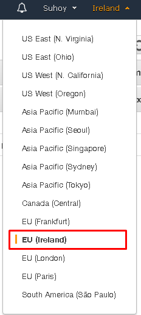

# Общие вопросы по работе с Amazon

Этот раздел посвящен общим проблемам, с которыми может столкнуться начинающий
при работе с AWS, но не касающиеся ни одного сервиса на прямую.

1. У меня пропали все созданные таблицы/функции/сервисы/... Кто-то ихх удалил?
    - Во первых стоит проверить, не поменялась ли географическая зона, в которой вы
работаете. Если все верно, тогда ищите инструменты аудита действий вашего аккаунта,
чтобы узнать что произошло.

    
    
<b>Следите за тем, в какой зоне вы используете сервисы</b>
