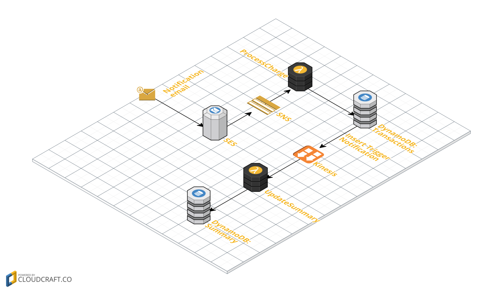
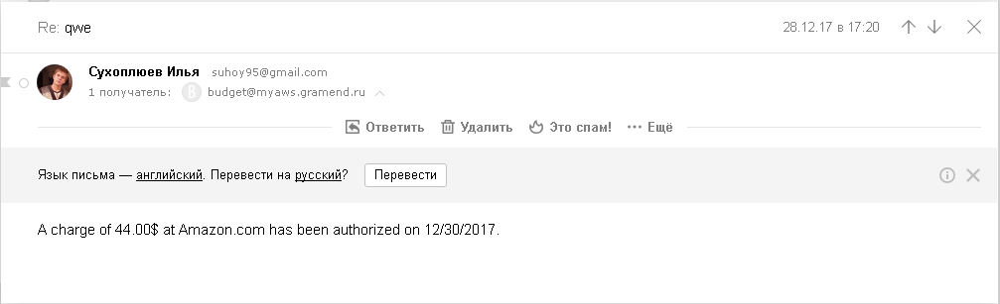
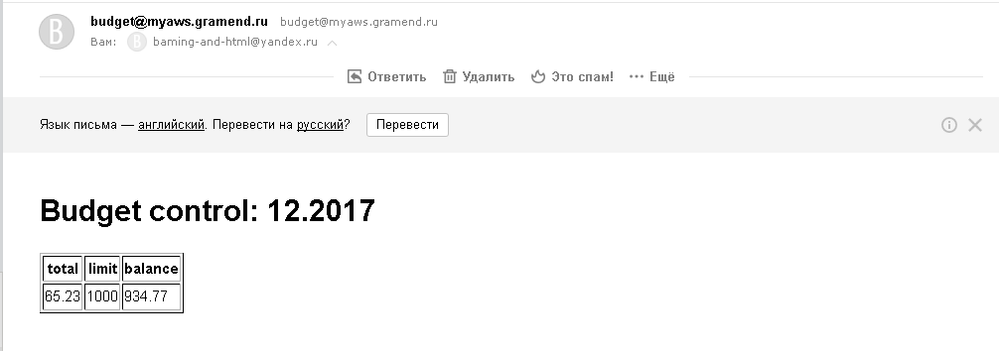

# Менеджер бюджета

Данный проект повторяет функциональность, описанную на статье [Хабрахабра](https://habrahabr.ru/post/334146/), но с использованием языка сценариев JavaScript.

Цель данного проекта — создание менеджера, который будет отслеживать
денежные операции проводимые с общей семейной карты и будет раз в день
сообщать об общей сумме потраченных средств, а также об остатке средств
запланированных на определенный период.

## Архитектура приложения

Основой данного проекта является отслеживание писем-уведомлений,
приходящих от банка и подсчета общей суммы расходов за определенный период.

Все данные будут хранится в двух [DynamoDB](../services/dynamo-db.md)-таблицах:
*mytransactions* и *budgets*. В первой будет содержаться записи о каждой покупке,
во второй же будет аккумулироваться сумма потраченных за месяц
средств и лимит средств на этот месяц.

Обработка этого сообщения детально будет проходить следующим образом:

1. На `budget@myaws.gramend.ru` будет приходить сообщение от банка определенного
формата;
1. [AWS SES](../services/ses.md) правило будет помещать это письмо в [SNS](../services/sns.md) топик `budget`;
1. Из этого топика сообщения будут обрабатываться [Lamda](../services/lambda.md)-функцией `ProcessCharge`, которая будет пытаться распарсить сообщение в
соответствии с регулярным выражением. И если формат сообщения соответствующий,
то функция будет заносить данные о полученной транзакции в таблицу `mytransaction`;
1. На событии вставки строки в `mytransactions` будет вызываться функция
`updatMybudget`, которая должна будет обновить бюджет за текущий период.

Не каждый банк имеет возможность отправлять email-уведомления, поэтоум в
учебных целях можно эмулировать это сообщение, отправив письмо со своего
почтового ящика.



Вторая часть данного сервиса — отправка уведомлений о состоянии бюджета:

1. С помощью сервиса CloudWatch можно назначть запуск lambda-функции `notify`;
1. `notify` будет брать данные из таблицы `budgets` за текущий период.
1. После этого она будет оформлять писмо, и отправлять его с ящика `budget@myaws.gramend.ru`.

В целях отладки работы всего сервиса целиком, можно запускать данную функцию не раз в день, а каждый раз после обновления таблицы `budgets`.


## Обработка сообщения от банка




**Функция ProcessCharge**
```javascript
'use strict';

// подключение AWS-библиотеки и создание подключения к DynamoDB
var AWS = require("aws-sdk");
var docClient = new AWS.DynamoDB.DocumentClient();

console.log('Loading function');

// функция ProcessCharge
exports.handler = (event, context, callback) => {

  // получение сообщения из SNS-очерди
  const message = JSON.parse(event.Records[0].Sns.Message);

  // Разбор получаемого сообщения
  const parts = /A charge of (\d+)\.(\d+)\$ at Amazon.com has been authorized on (\d{2})\/(\d{2})\/(\d{4})/.exec(message.content);
  if (!parts) {
    console.log("Doesn't match");
    return callback();
  }

  // создание сущности для таблицы mytransactions
  console.log(JSON.stringify(parts));
  const item = {
    id: Math.random(),
    sum: parseInt(parts[1]) + parseInt(parts[2])/100,
    date: `${parts[4]}.${parts[3]}.${parts[5]}`
  };

  // сохронение записи в таблицу
  console.log(item);
  docClient.put({
    TableName: 'mytransactions',
    Item: item
  }, callback);
};
```

**Функция updatMybudget**
```javascript
'use strict';

var AWS = require("aws-sdk");
var docClient = new AWS.DynamoDB.DocumentClient();

console.log('Loading function');

exports.handler = (event, context, callback) => {
  console.log('Received event:', JSON.stringify(event, null, 2));

  // обрабатываем только события добавления в таблицу `budgets`
  event.Records.filter(r => r.eventName === "INSERT")
    .forEach(r => {
      console.log(r.dynamodb.NewImage);
      const date = r.dynamodb.NewImage.date.S.substr(3);

      // получение бюджета за период, в который произошла транзакция
      getBudget(date, (err, budget) => {

        if(err) return callback(err);

        console.log('budget:', budget);

        if (budget) {
          // если такая запись существует, обновляем сумму потраченных денег
          // за текущий месяц
          console.log(budget.total, ' ', Number(r.dynamodb.NewImage.sum.N))
          console.log(budget.total + Number(r.dynamodb.NewImage.sum.N))
          docClient.put({
            TableName: 'budgets',
            Item: {
              date: budget.date,
              total: budget.total + Number(r.dynamodb.NewImage.sum.N),
              limit: budget.limit
            }
          }, callback);
        } else {
          // если нет = создаем новую запись
          docClient.put({
            TableName: 'budgets',
            Item: {
              date: date,
              total: Number(r.dynamodb.NewImage.sum.N),
              limit: 1000
            }
          }, callback);
        }
      });
    });

  callback(null, 'OK');
};

// получение записи из таблицы `budgets`
function getBudget(id, callback) {
  var params = {
    TableName : "budgets",
    Key: {
      date: id
    }
  };

  console.log(`getBudget(${id})`)
  docClient.get(params, function(err, data) {
    if (err) {
      console.log("Unable to getBudget. Error:", JSON.stringify(err, null, 2));
      callback(err);
    } else {
      console.log("getBudget succeeded.", JSON.stringify(data, null, 2));
      callback(null, data.Item);
    }
  });
}

```


## Отправка уведомления об остатках бюджета

**Функция notify**
```javascript
var AWS = require('aws-sdk');
var docClient = new AWS.DynamoDB.DocumentClient();

exports.handler = (event, context, callback) => {

  // Получение текщей даты
  const now = new Date();
  const id = `${padStr(now.getMonth()+1)}.${now.getFullYear()}`;

  // Поиск бюджета за текущий год
  getBudget(id, (err, data) => {

    if (err) return callback(err);

    if(!data) return callback(new Error('not current budget'));

    // оформление письма-отчета
    var params = {
      Destination: { /* required */
        CcAddresses: [],
        ToAddresses: [
          'baming-and-html@yandex.ru'
        ]
      },
      Message: { /* required */
        Body: {
          Html: {
            Charset: "UTF-8",
            Data: `
<h1> Budget control: ${data.date}</h1>
<table border=1>
  <tr>
    <th>total</th>
    <th>limit</th>
    <th>balance</th>
  </tr>
  <tr>
    <td>${data.total}</td>
    <td>${data.limit}</td>
    <td>${data.limit - data.total}</td>
  </tr>
</table>
          `
        }
        },
        Subject: {
        Charset: 'UTF-8',
        Data: 'Your budget control'
        }
      },
    Source: 'budget@myaws.gramend.ru'
  };

  // отправка письма
  var sendPromise = new AWS.SES().sendEmail(params).promise();
  sendPromise.then(data => callback(null, data)).catch(callback);
  });
};

function getBudget(id, callback) {
  var params = {
    TableName : "budgets",
    Key: {
      date: id
    }
  };

  console.log(`getBudget(${id})`)
  docClient.get(params, function(err, data) {
    if (err) {
      console.log("Unable to getBudget. Error:", JSON.stringify(err, null, 2));
      callback(err);
    } else {
      console.log("getBudget succeeded.", JSON.stringify(data, null, 2));
      callback(null, data.Item);
    }
  });
}

function padStr(i) {
  return (i < 10) ? "0" + i : "" + i;
}
```


