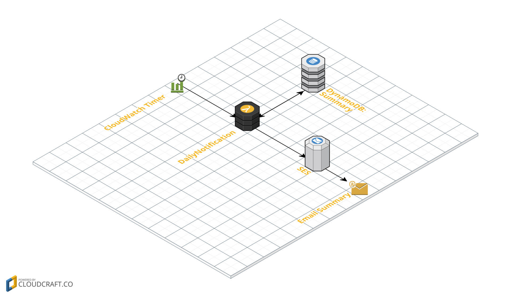

# Менеджер бюджета

[Хабрахабра](https://habrahabr.ru/post/334146/)

## Архитектура приложения




## Обработка сообщения от банка


```javascript
'use strict';

var AWS = require("aws-sdk");
var docClient = new AWS.DynamoDB.DocumentClient();

console.log('Loading function');

exports.handler = (event, context, callback) => {
    const message = JSON.parse(event.Records[0].Sns.Message);
    // console.log(message.content);
    const parts = /A charge of (\d+)\.(\d+)\$ at Amazon.com has been authorized on (\d{2})\/(\d{2})\/(\d{4})/.exec(message.content);
    if (!parts) {
        console.log("Doesn't match");
        return callback();

    }
    console.log(JSON.stringify(parts));
    const item = {
      id: Math.random(),
      sum: parseInt(parts[1]) + parseInt(parts[2])/100,
      date: `${parts[4]}.${parts[3]}.${parts[5]}`
    };
    console.log(item);
    docClient.put({
        TableName: 'mytransactions',
        Item: item
    }, callback);
};
```


```javascript
'use strict';

var AWS = require("aws-sdk");
var docClient = new AWS.DynamoDB.DocumentClient();

console.log('Loading function');

exports.handler = (event, context, callback) => {
    console.log('Received event:', JSON.stringify(event, null, 2));

    event.Records.filter(r => r.eventName === "INSERT")
        .forEach(r => {
            console.log(r.dynamodb.NewImage);
            const date = r.dynamodb.NewImage.date.S.substr(3);
            getBudget(date, (err, budget) => {

            if(err) return callback(err);

            console.log('budget:', budget);

            if (budget) {
                console.log(budget.total, ' ', Number(r.dynamodb.NewImage.sum.N))
                console.log(budget.total + Number(r.dynamodb.NewImage.sum.N))
                docClient.put({
                    TableName: 'budgets',
                    Item: {
                        date: budget.date,
                        total: budget.total + Number(r.dynamodb.NewImage.sum.N),
                        limit: budget.limit
                    }
                }, callback)
            } else {
                docClient.put({
                    TableName: 'budgets',
                    Item: {
                        date: date,
                        total: Number(r.dynamodb.NewImage.sum.N),
                        limit: 1000
                    }
                }, callback)
            }

            });
        });

    callback(null, 'OK');
};

function getBudget(id, callback) {
    var params = {
        TableName : "budgets",
        Key: {
            date:  id
        }
    };

    console.log(`getBudget(${id})`)
    docClient.get(params, function(err, data) {
        if (err) {
            console.log("Unable to getBudget. Error:", JSON.stringify(err, null, 2));
            callback(err);
        } else {
            console.log("getBudget succeeded.", JSON.stringify(data, null, 2));
            callback(null, data.Item);
        }
    });
}

```


## Отправка уведомления об остатках бюджета

```javascript
var AWS = require('aws-sdk');
var docClient = new AWS.DynamoDB.DocumentClient();

exports.handler = (event, context, callback) => {
    const now = new Date();
    const id = `${padStr(now.getMonth()+1)}.${now.getFullYear()}`;

    getBudget(id, (err, data) => {

    if (err) return callback(err);

    if(!data) return callback(new Error('not current budget'));

    var params = {
      Destination: { /* required */
        CcAddresses: [],
        ToAddresses: [
          'baming-and-html@yandex.ru'
        ]
      },
      Message: { /* required */
        Body: {
          Html: {
           Charset: "UTF-8",
           Data: `
<h1> Budget control: ${data.date}</h1>
<table border=1>
  <tr>
    <th>total</th>
    <th>limit</th>
    <th>balance</th>
  </tr>
  <tr>
    <td>${data.total}</td>
    <td>${data.limit}</td>
    <td>${data.limit - data.total}</td>
  </tr>
</table>
          `
          }
         },
         Subject: {
          Charset: 'UTF-8',
          Data: 'Your budget control'
         }
        },
      Source: 'budget@myaws.gramend.ru'
    };
    // console.log(params.Message.Body.Text.Data)
    var sendPromise = new AWS.SES().sendEmail(params).promise();
    sendPromise.then(data => callback(null, data)).catch(callback);
    });
};

function getBudget(id, callback) {
    var params = {
        TableName : "budgets",
        Key: {
            date:  id
        }
    };

    console.log(`getBudget(${id})`)
    docClient.get(params, function(err, data) {
        if (err) {
            console.log("Unable to getBudget. Error:", JSON.stringify(err, null, 2));
            callback(err);
        } else {
            console.log("getBudget succeeded.", JSON.stringify(data, null, 2));
            callback(null, data.Item);
        }
    });
}

function padStr(i) {
    return (i < 10) ? "0" + i : "" + i;
}
```


