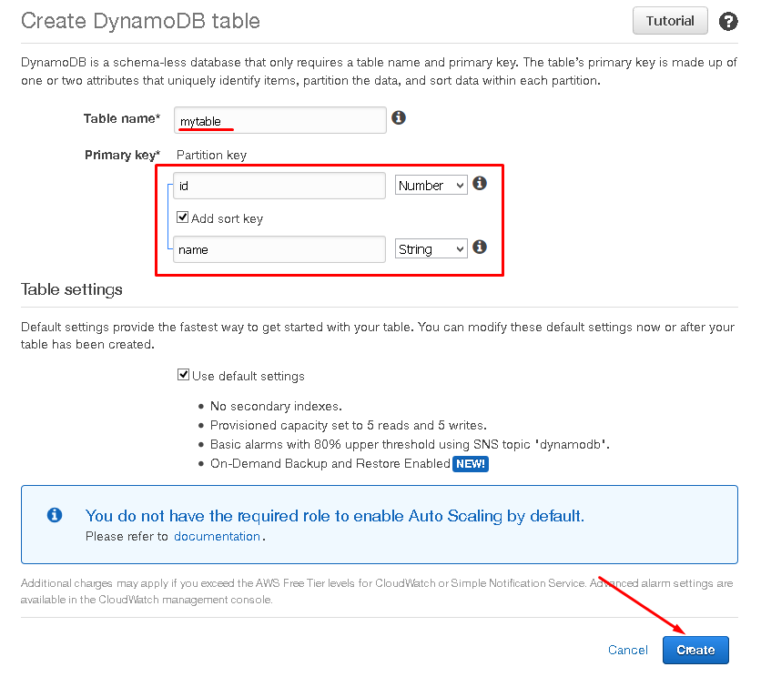
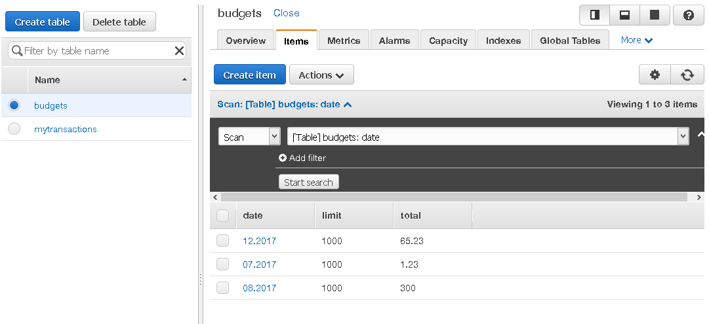

# DynamoDB

Welcome to the Amazon DynamoDB Developer Guide.

Amazon DynamoDB is a fully managed NoSQL database service that provides fast and predictable performance with seamless scalability. DynamoDB lets you offload the administrative burdens of operating and scaling a distributed database, so that you don't have to worry about hardware provisioning, setup and configuration, replication, software patching, or cluster scaling.

With DynamoDB, you can create database tables that can store and retrieve any amount of data, and serve any level of request traffic. You can scale up or scale down your tables' throughput capacity without downtime or performance degradation, and use the AWS Management Console to monitor resource utilization and performance metrics.

[Документация Amazon](https://docs.aws.amazon.com/amazondynamodb/latest/developerguide/Introduction.html)

