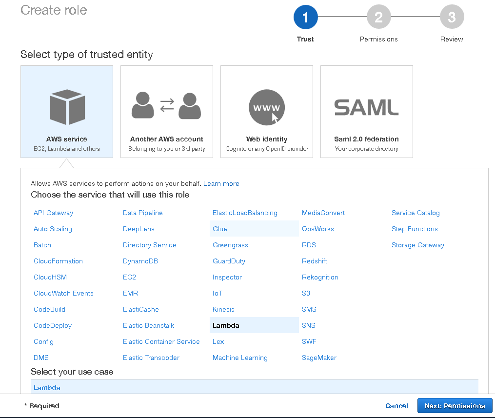
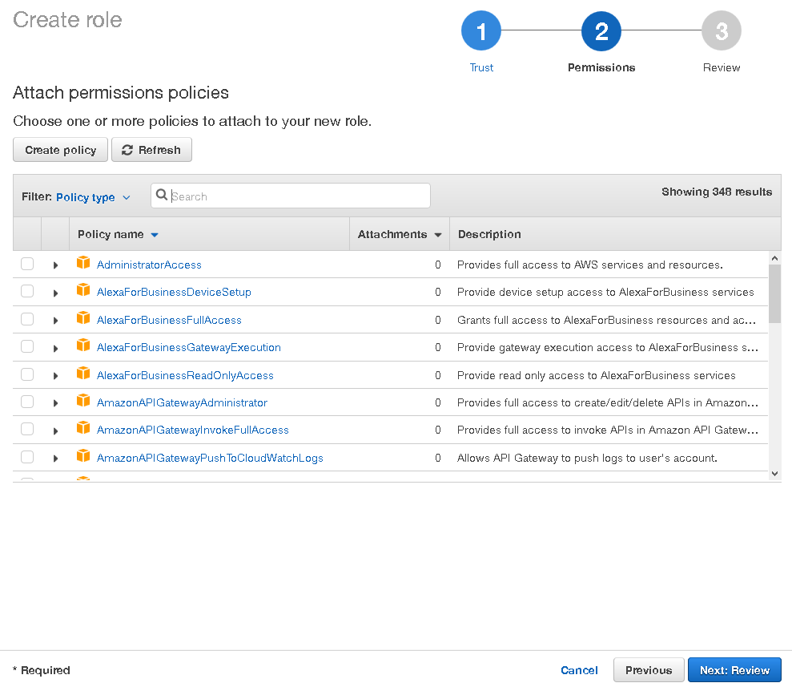
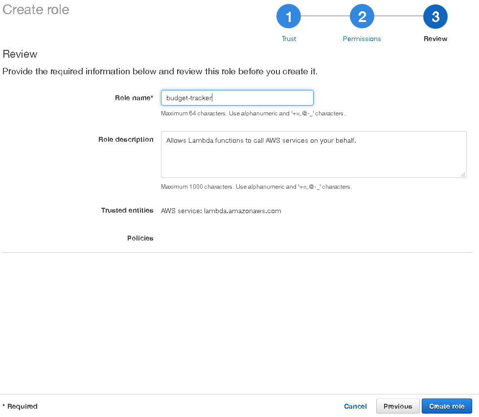
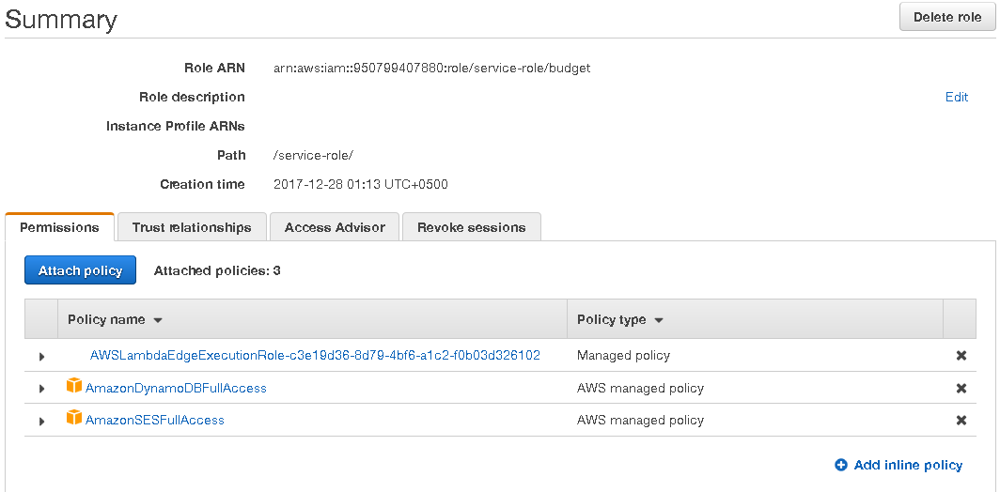

# Identity and Access Management (IAM)

Пожалуй, один из самых выжных сервисов — Amazon IAM, позволяет создавать
пользователей для коллективной разработки в рамках компании, также в его
функциональность входит описание и назначение привилегий.

После регистрации главного аккаунта (называемый, также как в Unix root-овый) рекомендуется создать специального пользователя, от которого будет вестись вся разработка. Это позволит ограничить возможность совершения непредвиденных критических для приложения действий.

[Документация AWS IAM](https://docs.aws.amazon.com/IAM/latest/UserGuide/introduction.html)

## Создание роли

## Редактирование роли

