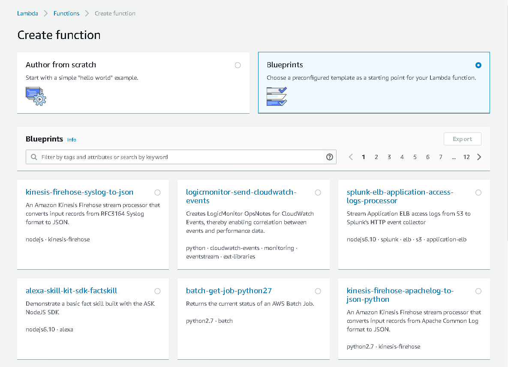
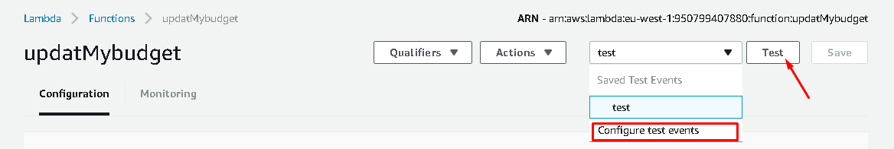
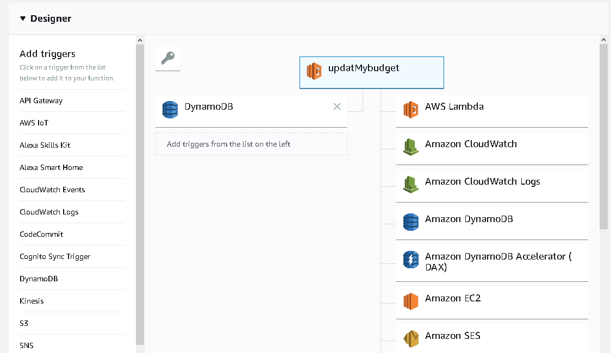
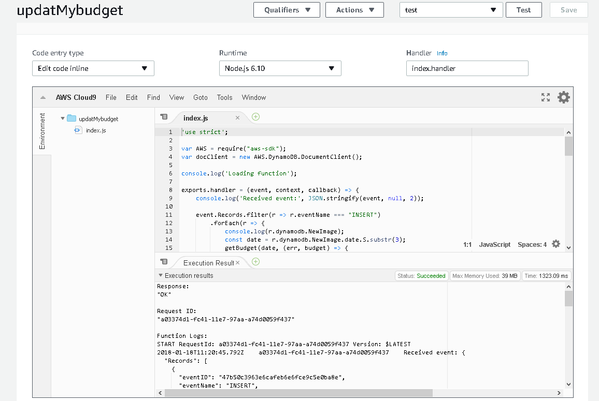
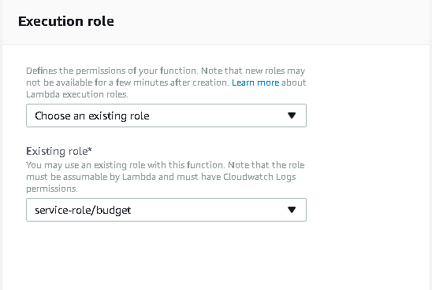

# Lambda

AWS Lambda — сервис позволяющий описывать функции, которые будут выполнятся при
тех или иных условиях. В дополнение к этому, при необходимости они будут
масштабироваться по дата-центрам Amazon. На сегодняшний день данные функции
можно описывать на популярных языках программирования Node.js, Java, C#, Go and Python.

[Документация AWS Lambda](https://docs.aws.amazon.com/lambda/latest/dg/welcome.html)

## Создание lambda-функции

## Тестирование и отладка lambda-функции

## Редактирование Lambda-функции

