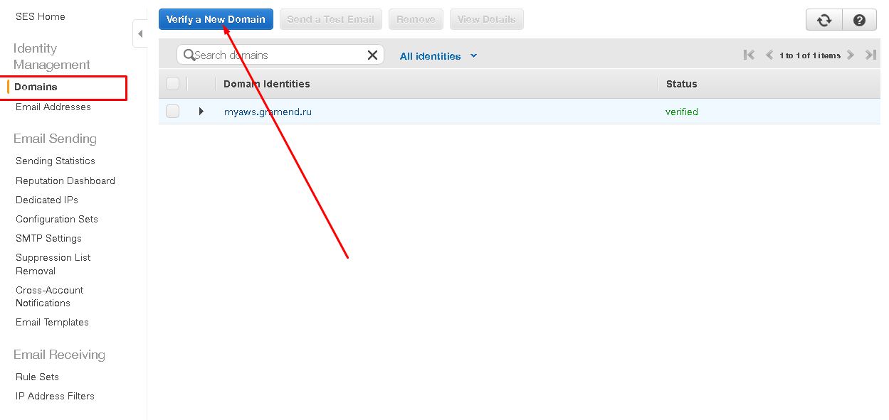
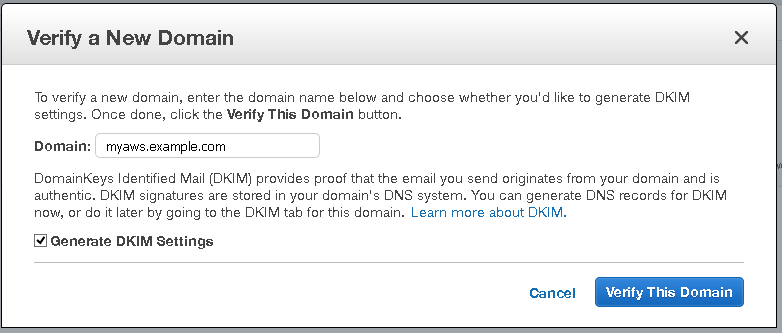
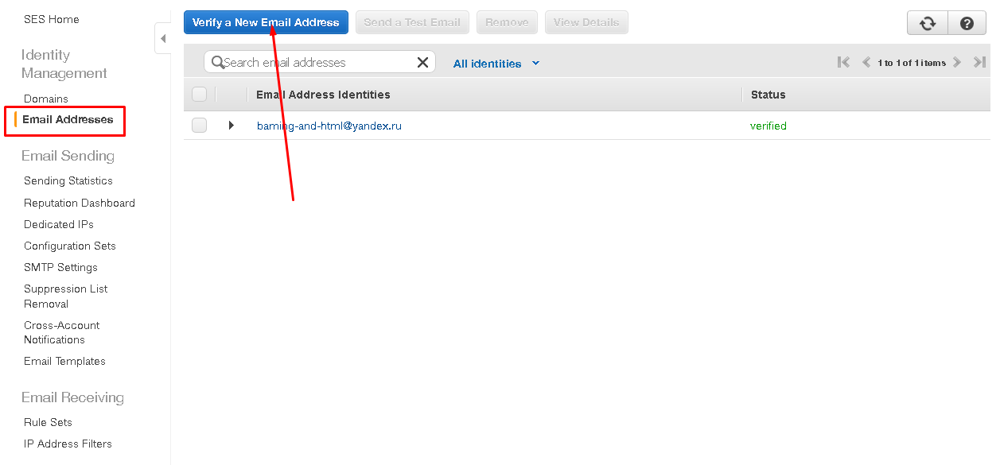
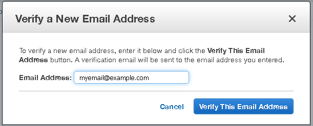
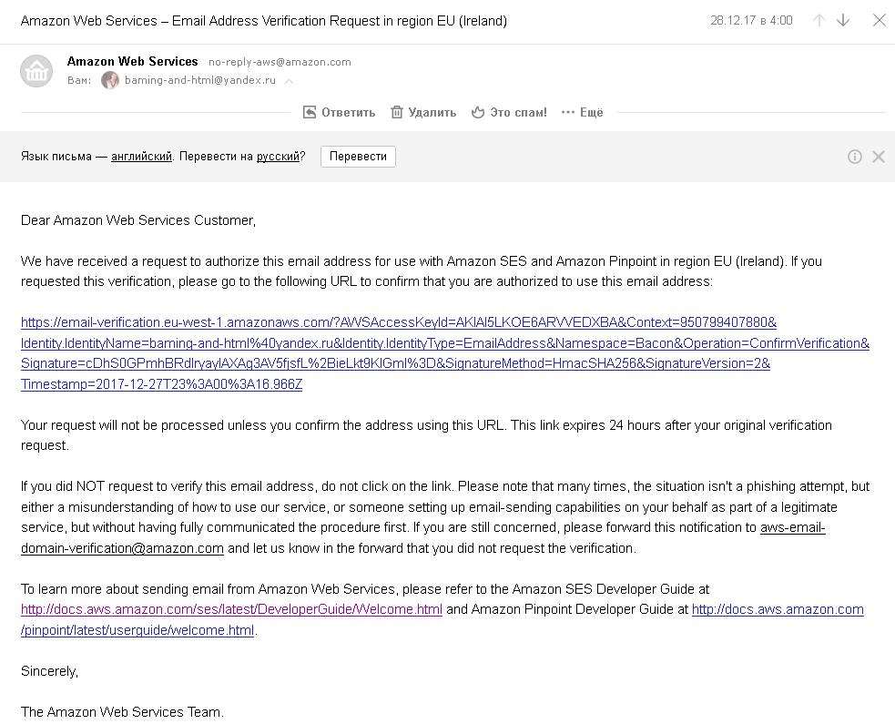
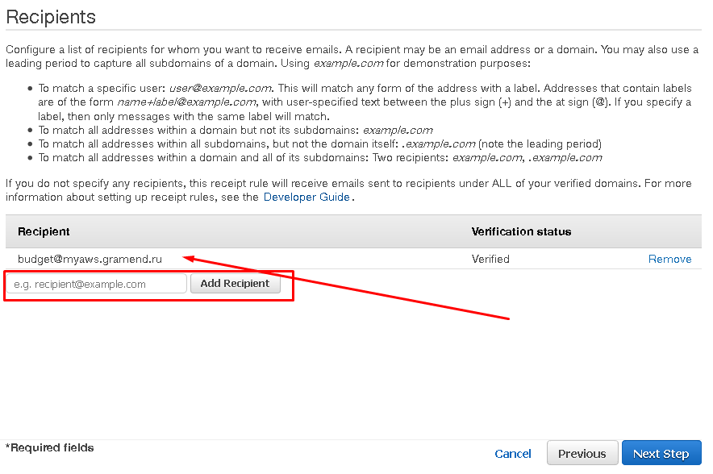
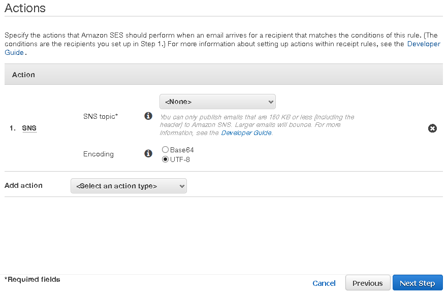
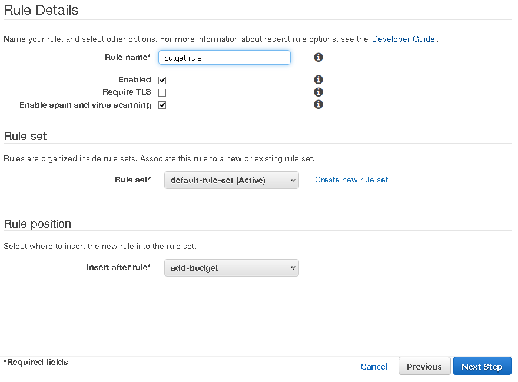
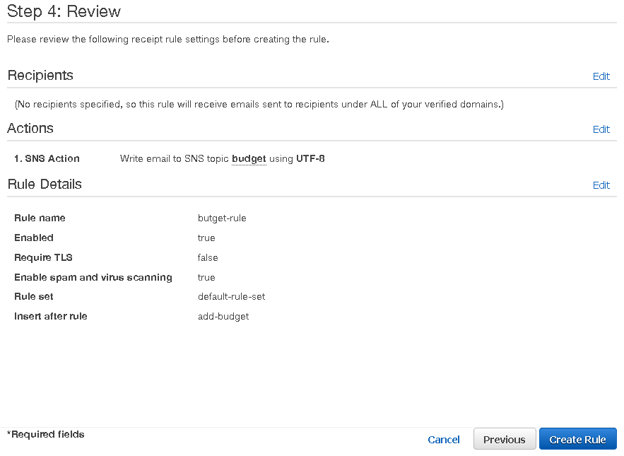

# Simple Email Service (SES)

Welcome to the Amazon Simple Email Service (Amazon SES) Developer Guide. Amazon SES is an email platform that provides an easy, cost-effective way for you to send and receive email using your own email addresses and domains.

For example, you can send marketing emails such as special offers, transactional emails such as order confirmations, and other types of correspondence such as newsletters. When you use Amazon SES to receive mail, you can develop software solutions such as email autoresponders, email unsubscribe systems, and applications that generate customer support tickets from incoming emails.

You only pay for what you use, so you can send and receive as much or as little email as you like. For service highlights, FAQs, and pricing information, go to the Amazon SES Detail Page.

[Документация Amazon SES](https://docs.aws.amazon.com/ses/latest/DeveloperGuide/Welcome.html)

## Валидация домена для отправки сообщений

- [DKIM и SPF](https://habrahabr.ru/post/322616/)

## Валидация email

## Создание правила

