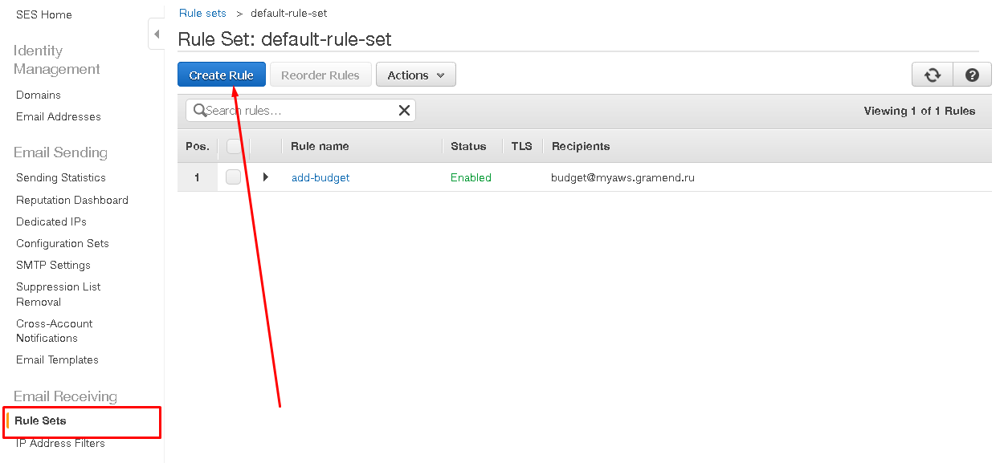

# Simple Email Service (SES)

Amazon SES (Simple Email Service или простой email-сервис) — служба позволяющая
работать с электронной почтой: отправлять и получать сообщения, устраивать
электронные рассылки и следить за репутацией вашего почтового ящика.

Для этого, вам потребуется валидный домен, на ящики которого будут отправляться письма
или с которого они отправляться. Для этого нужно предварительно иметь настроенный в
[Route 53](../route-53.md).

[Документация AWS SES](https://docs.aws.amazon.com/ses/latest/DeveloperGuide/Welcome.html)

## Валидация домена для отправки и приема сообщений

Когда вы проделаете эти шаги в Route 53 будут занесены MX и TXT записи,
необходимые для подтверждения, что этот домен принадлежит вам и вы вправе отправлять с
него почту. Эти записи реализуют несколько механизмов —
[DKIM и SPF](https://habrahabr.ru/post/322616/).

## Валидация email

В проекте нам понадобится отправлять письмо на личный email. Для этого,
чтобы избежать неоправданных и случайных спам рассылок в Amazon SES встроен
механизм предварительной валидации email-адреса, в ходе которой владелец
ящика соглашается на получение почту от вашего сервиса.

## Создание правила

Для обработки полученных писем автоматически в Amazon SES можно создавать
наборы правил, которые будут описывать как поступить с полученным письмом.

