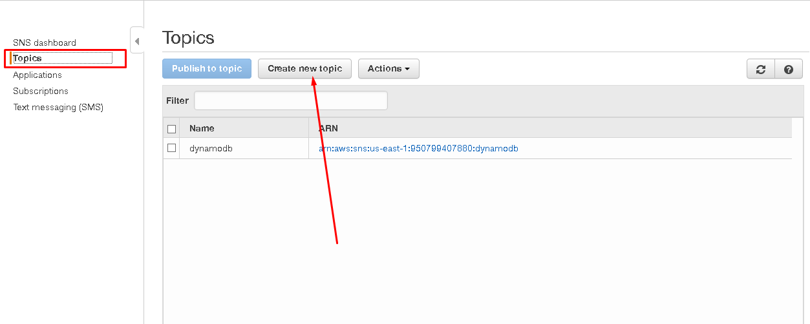
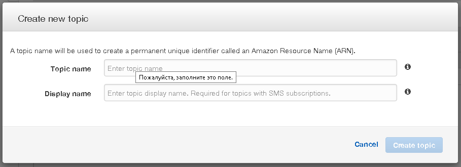
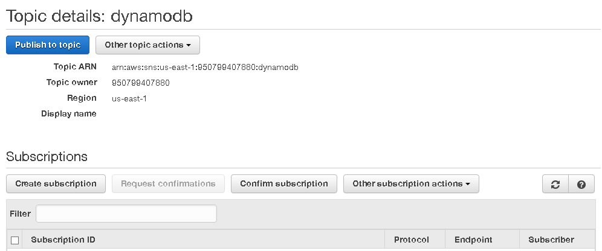
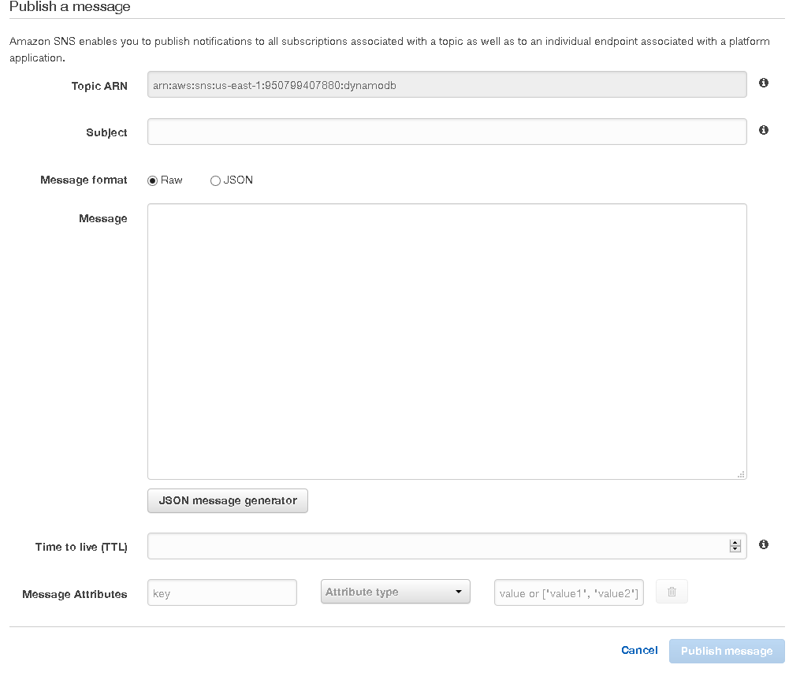

# Simple Notification Service (SNS)

C помощью Amazon Simple Notification Service (SNS, или *простой сервис увидомлений*)
можно создавать специальные информационные каналы рассылок, которые смогут
уведомлять подписавшихся на них пользователей, будь то мобильное приложение
или уведомления на WEB-сайте.

Основной сущностью данного сервиса является *тема* (топик), в который из разных
источников будут приходить сообщения, после чего они будут
отправляться *подписчикам* в виде почтовых писем или СМС-уведомлений.
Также данные сообщения могут обрабатывать и другие сервисы Амазона, например,
с помощью [Lambda](./lambda.md)-функции, как в это делается в
[менеджере бюджета](../projects/budget-manager.md).

[Документация AWS SNS](https://docs.aws.amazon.com/sns/latest/dg/GettingStarted.html)

## Создание темы (topic)

## Работа с созданной темой

